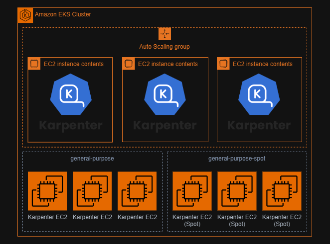

# Karpenter with EKS boilerplate

Karpenter is running in the default 3 nodes of EKS ASG

The infrastructure is created by terraform and the cluster configuration with anible.

## Deploy

Setup provider.aws in `main.tf`

Change `bastion_config.source_cidr` to your IP in `development.tfvars`

Create your own ssh key with `ssh-keygen` and set `bastion_config.public_key_path` and `bastion_config.private_key_path` in `development.tfvars`

<!-- BEGIN_TF_DOCS -->
## Requirements

| Name | Version |
|------|---------|
|  [aws](#requirement\_aws) | >=5.58.0 |

## Providers

| Name | Version |
|------|---------|
|  [aws](#provider\_aws) | 5.62.0 |

## Modules

| Name | Source | Version |
|------|--------|---------|
|  [ansible](#module\_ansible) | ./modules/ansible | n/a |
|  [bastion](#module\_bastion) | ./modules/bastion | n/a |
|  [eks](#module\_eks) | ./modules/eks | n/a |
|  [network](#module\_network) | ./modules/network | n/a |

## Resources

| Name | Type |
|------|------|
| [aws_ami.ubuntu](https://registry.terraform.io/providers/hashicorp/aws/latest/docs/data-sources/ami) | data source |

## Inputs

| Name | Description | Type | Default | Required |
|------|-------------|------|---------|:--------:|
|  [bastion\_config](#input\_bastion\_config) | bastion EC2 configuration | <pre>object({     instance_type    = string     volume_type      = string     volume_size      = number     private_ip       = string     source_cidr      = string     public_key_path  = string     private_key_path = string   })</pre> | n/a | yes |
|  [default\_tags](#input\_default\_tags) | AWS Tags to add to all resources created | `map(any)` | <pre>{   "Application": "EKS Karpenter Boiler plate",   "Environment": "",   "Name": "",   "Owner": "",   "Terraform": "true",   "Type": "" }</pre> | no |
|  [eks](#input\_eks) | EKS configuration | <pre>object({     name                = string     version             = string     private_endpoint    = bool     public_endpoint     = bool     public_access_cidrs = list(string)     control_plane_cidr  = string   })</pre> | n/a | yes |
|  [eks\_addons\_version](#input\_eks\_addons\_version) | EKS addons | `map(string)` | n/a | yes |
|  [eks\_node\_group](#input\_eks\_node\_group) | EKS node group configuration | <pre>object({     name            = string     disk_size       = number     capacity_type   = string     instance_types  = list(string)     desired_size    = number     max_size        = number     min_size        = number     max_unavailable = number   })</pre> | n/a | yes |
|  [net\_cidr](#input\_net\_cidr) | CIDR used in the project | <pre>object({     vpc              = string,     eks_subnet       = list(string),     pub_subnet       = list(string)   })</pre> | n/a | yes |
|  [project\_name](#input\_project\_name) | Name of the project | `string` | n/a | yes |
|  [region](#input\_region) | Region where the project will initialize | `string` | n/a | yes |

## Outputs

| Name | Description |
|------|-------------|
|  [bastion\_public\_ip](#output\_bastion\_public\_ip) | n/a |
<!-- END_TF_DOCS -->
